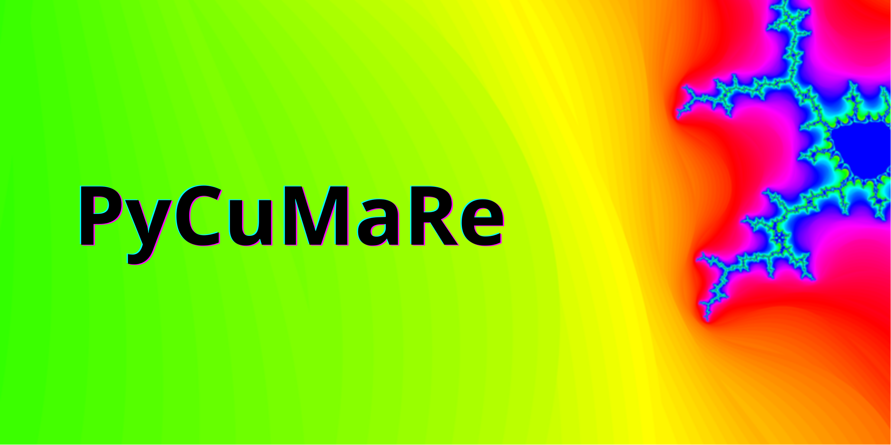
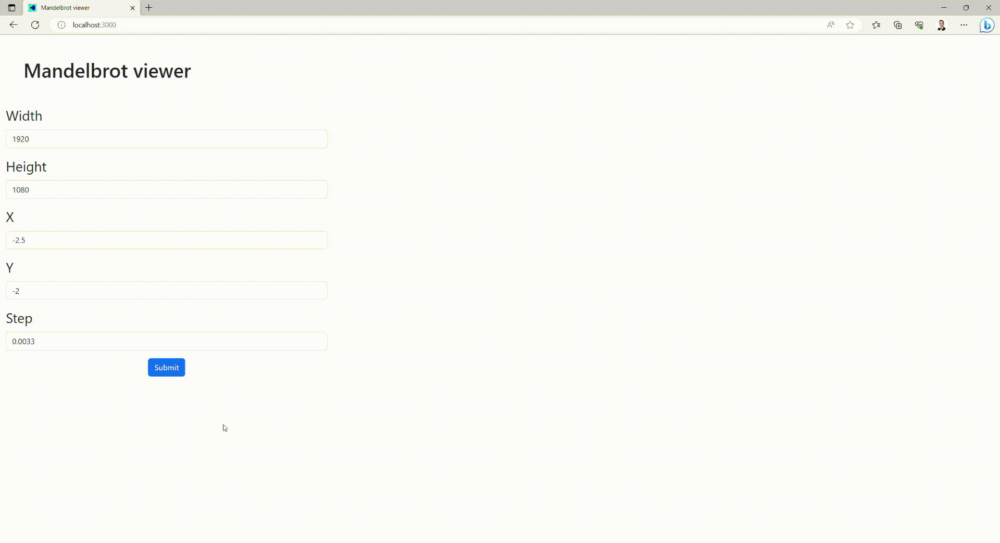

# PyCuMaRe

Full-stack application that visualizes Mandelbrot set in area selected by user.


## Description

This is a simple full-stack application, that takes advantage of performing computation on the device supporting CUDA, and presents result in React frontend using Python backend. Hence **Py**thon, **Cu**da, **Ma**ndelbrot, **Re**act.

## Dependencies

* Nvidia graphics card supporting CUDA (tested on 3060Ti)
* Python version supporting numba (3.9.0 was used)
* Python packages
    ````
    python -m pip install numpy numba opencv-python fastapi uvicorn
    ````
* NPM packages
    ````
    npm install react react-bootstrap bootstrap
    ````

## Results

With corretly installed dependencies it should be possible to run an app with prepared "run.bat" script under windows. Frontend should be build automatically. New browser window will be opened with default values.

* width & height - image size in pixels
* X - first coordinate on real axis
* Y - first coordinate on imaginary axis
* step - distance between each pixel in X/Y axis

